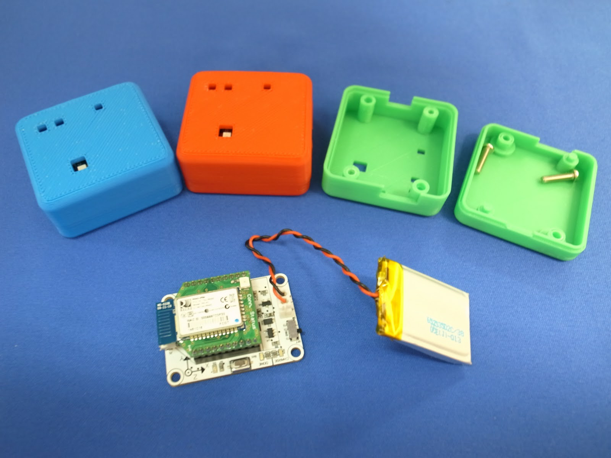

# RT-BT-9AXIS-00

本リポジトリは無線9軸IMUセンサモジュールのサンプルプログラムおよびマニュアル
をまとめたものです.  各種ファイルの内容は以下になります.  

## Circuit
無線9軸IMUセンサモジュールの回路図です.

## Container-3Ddata
無線9軸IMUセンサモジュールおよび, 付属のlipoバッテリーが入る
ケースの3Dプリンタ用のデータです.  3Dプリント用stlデータの他に3DCAD用のデータ
および, センサ基板の外形寸法図を公開しています.  

--注意--   
製品にケースは付属しません.  3Dプリンタ用のデータのみ公開ですので,
ケースが必要な際は各自でプリントして下さい.  

## LPCXpresso sample
LPCXpressoとはLPCマイコン(lpc1343)の統合開発環境です.  
<http://www.nxp-lpc.com/lpc_boards/lpcxpresso/>
本センサモジュールに最初に書き込まれているファームウェアの
プロジェクトです.  開発環境の構築方法およびサンプルプロジェクト
のインポート方法についてはManualフォルダ内のマニュアルを
参照してください.  

## Datasheet
bletoothモジュールRN-42, 9軸センサMPU9250およびlpc1343マイコンのデータシートです.

## Firmware
出荷時にlpc1343マイコンに書き込まれているファームウェアです.  
このファームウェアはUSB接続時100Hz, Bluetooth接続時
20Hzでセンサデータを出力します.  

## Manual
無線9軸IMUセンサモジュールのマニュアルです.

## Driver
Windows環境用のUSBドライバです.  Windows環境でUSBを使用する際は
ファイルを解凍し中のドライバをインストールして下さい.
ドライバのインストール方法についてはmanualフォルダ内のマニュアルを
参照してください.
Linux環境においてはドライバーのインストールは必要ありません.  

## Prossesing Sample Program
ProcessingはC言語風の文法で図形の描画等の視覚的表現が手軽に実現
できる環境です.  本センサモジュールのサンプルとして, Processingで
動作するものを提供しています.  

## Linux Sample Program
Linux環境でセンサから出力されるデータを取得するサンプルプログラムです.
